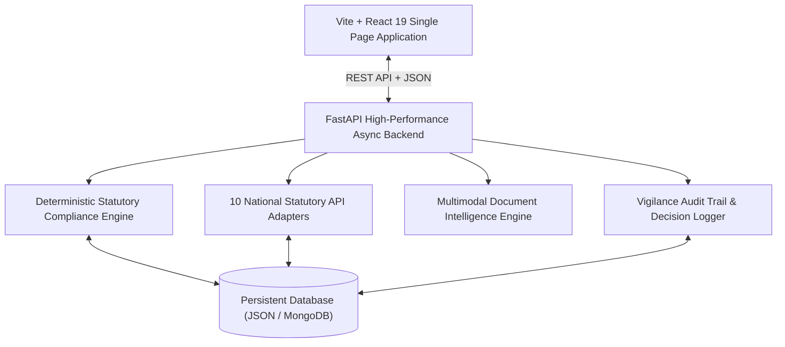

# GeM Sentinel AI — AI-Powered Integrated Bid Compliance Verification Platform

[](https://python.org)
[](https://fastapi.tiangolo.com)
[](https://react.dev)
[](https://vitejs.dev)
[](https://tailwindcss.com)
[](https://sih.gov.in)

> **Problem Statement ID:** 26100  
> **Title:** AI-Powered Integrated Bid Compliance Verification Platform for GeM Procurement  
> **Organization:** Ministry of Petroleum & Natural Gas  
> **Department:** Chennai Petroleum Corporation Limited (CPCL)  
> **Category:** Software | **Theme:** Smart Automation  

---

## 🏛️ Executive Summary

**GeM Sentinel AI** is an enterprise-grade GovTech platform designed to transform public procurement compliance verification for **Chennai Petroleum Corporation Limited (CPCL)** and the **Government e-Marketplace (GeM)**.

In Indian public procurement governed by the **General Financial Rules (GFR 2017)** and **DPIIT Public Procurement (Preference to Make in India) Order 2017**, verifying bidder qualifications across statutory, tax, corporate standing, and local content criteria requires hundreds of hours of manual cross-referencing. GeM Sentinel AI automates this verification pipeline, slashing average bid verification cycle time from **~4.2 hours to ~8 minutes per bid pack** (94.8% manual effort reduction).

---

## 🚀 Key Functional Capabilities

1. **Procurement Operations Center & Dynamic KPI Dashboard**
   * Real-time metrics across 7 CPCL refinery tenders (Manali, Cauvery Basin, Nagapattinam).
   * Live statutory risk stratification (Critical, High, Medium, Low).
   * Transparent compliance score distribution across all 74 participating bidders.
   * Chronological vigilance event stream tracking every officer review and statutory verification.

2. **Prioritized Statutory Verification Queue (70 Active Items)**
   * Severity-ranked queue triage (`CRITICAL`, `HIGH`, `MEDIUM`).
   * Explicit statutory citations: GFR Rule 151 debarment, MCA21 Section 248 strike-off, CGST Act Sec 25 GSTR-3B lapses, IT Act Sec 206AB withholding, and PPP-MII domestic value addition shortfalls.
   * Direct one-click drill-down to vendor dossiers.

3. **Master Bidder Registry (74 Vendors Across 7 Tenders)**
   * Complete visibility into participating vendors with tender-specific and multi-tender filtering.
   * Instant search across Bidder ID, Company Name, State, and Industry Sector.
   * Configurable pagination (15, 20, 50, 100/page) and multi-column sorting (Score, Risk, Bidder ID, Company).
   * Clear business findings tags (e.g., *"GSTR-3B Filing Lapse"*, *"RoC Strike-off Proceedings"*, *"Sec 206AB Non-Filer Withholding"*).

4. **Bidder Compliance Dossier & Six Statutory Pillars**
   * Detailed breakdown across the **Six Statutory Pillars**:
     1. Statutory Standing (GFR Rule 151)
     2. Tax Compliance (CGST Act & Sec 206AB)
     3. Registration Standing (Udyam & DPIIT Startup)
     4. Tender Eligibility & Technical Authorizations
     5. Make in India Domestic Value Addition (PPP-MII Order 2017)
     6. Mandatory Documentation & Integrity Declarations
   * **Explainable AI Drawer ("Why Flagged?")**: Plain-language statutory rationale and recommended procurement officer actions.

5. **National Statutory Integration Gateway (10 Modular Adapters)**
   * **GSTN API Adapter:** 15-character GSTIN format, active registration, and return recency.
   * **CBDT PAN & Sec 206AB Gateway:** PAN structure, linkage, and 206AB/206CCA non-filer surcharge check.
   * **MCA21 / RoC Connector:** CIN/LLPIN validation and Section 248 strike-off notice detection.
   * **Udyam & MSME Databank:** Udyam registration number verification and legacy EM-II expiration detection.
   * **DPIIT Startup India Portal:** Form-1 recognition validation for turnover/experience exemptions.
   * **EPFO & ESIC Labor Portals:** Establishment search and Section 7A / 45A arrears verification.
   * **GeM Incident Management & Debarment Watchlist:** Central public sector debarment detection.
   * **NSIC & CPPP Integration:** Single-Point Registration Scheme fee/EMD exemption verification.

6. **OCR & Multimodal Document Intelligence**
   * Automated parsing of bidder-submitted PDFs (GST certificates, PAN cards, Udyam affidavits, OEM declarations).
   * Discrepancy cross-matching between declared tender parameters and sovereign portal records.

7. **Side-by-Side Comparative Matrix**
   * Multi-vendor comparative evaluation across statutory standing, tax status, local content, and risk scores.

8. **Official CPCL Compliance Dossier & Vigilance Audit Trail**
   * Comprehensive printable report with immutable audit hashes.
   * **GFR 2017 Rule 144 Governance Notice:** All AI outputs are explicitly advisory; final qualification/disqualification authority remains with the designated Procurement Officer.
   * **SIMULATED GOVERNMENT DATA** disclosure prominently displayed across all integration feeds.

---

## 🏗️ System Architecture



---

## ⚡ Quickstart Guide

### Prerequisites
* **Python:** 3.11 or 3.12
* **Node.js:** 18+ or 20+
* **npm:** 9+

### 1. Clone the Repository
```bash
git clone https://github.com/Arpithbhat-07/GeM.git
cd GeM
```

### 2. Backend Setup & Launch
```bash
cd backend

# Create and activate virtual environment
python -m venv venv
# On Windows:
.\venv\Scripts\activate
# On Linux/macOS:
source venv/bin/activate

# Install dependencies
pip install -r requirements.txt

# Start the FastAPI server (runs on port 8000)
uvicorn app.main:app --host 127.0.0.1 --port 8000 --reload
```
* **API Swagger Docs:** `http://127.0.0.1:8000/docs`
* **Health Check:** `http://127.0.0.1:8000/api/health`

### 3. Frontend Setup & Launch
```bash
cd ../frontend

# Install dependencies
npm install

# Start Vite development server (runs on port 5173)
npm run dev -- --host 127.0.0.1 --port 5173
```
* **Web Portal:** `http://127.0.0.1:5173`

---

## 🧪 Automated QA & Integrity Verification

Run the automated test suites from the `backend/` directory:

```bash
cd backend

# 1. Full Data Integrity Verification (Tenders, Bidders, Checks, Adapters)
python verify_data_integrity.py

# 2. Live End-to-End Workflow Verification (8 Core Steps)
python test_live_e2e.py

# 3. Full API & Frontend Endpoint Test Suite
python test_full_suite.py
```

Expected output:
```
============================================================
>>> FINAL QA VERIFICATION RESULT: 100% PASS <<<
============================================================
```

---

## ⚖️ Legal & Governance Disclosures

1. **GFR 2017 Rule 144 Adherence:** This platform acts as an assistive decision-support intelligence tool for procurement committees. Final administrative determinations, bid rejections, and contract awards are executed strictly by authorized Procurement Officers.
2. **Simulated Government Data:** All GSTINs, PANs, CINs, Udyam IDs, and vendor entity records in this prototype are synthetic, generated strictly for technical demonstration and testing of algorithmic verification flows.

---

## 👥 Authors & Acknowledgments

* **Lead Full-Stack Engineer & Product Architect:** Arpith Bhat ([@Arpithbhat-07](https://github.com/Arpithbhat-07))
* **Challenge:** Smart India Hackathon (SIH) 2026
* **Organization:** Ministry of Petroleum & Natural Gas — Chennai Petroleum Corporation Limited (CPCL)
